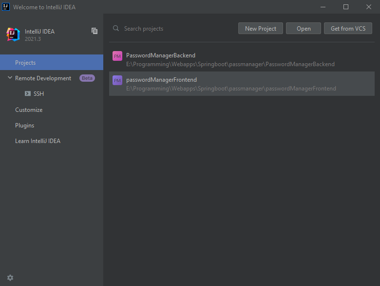
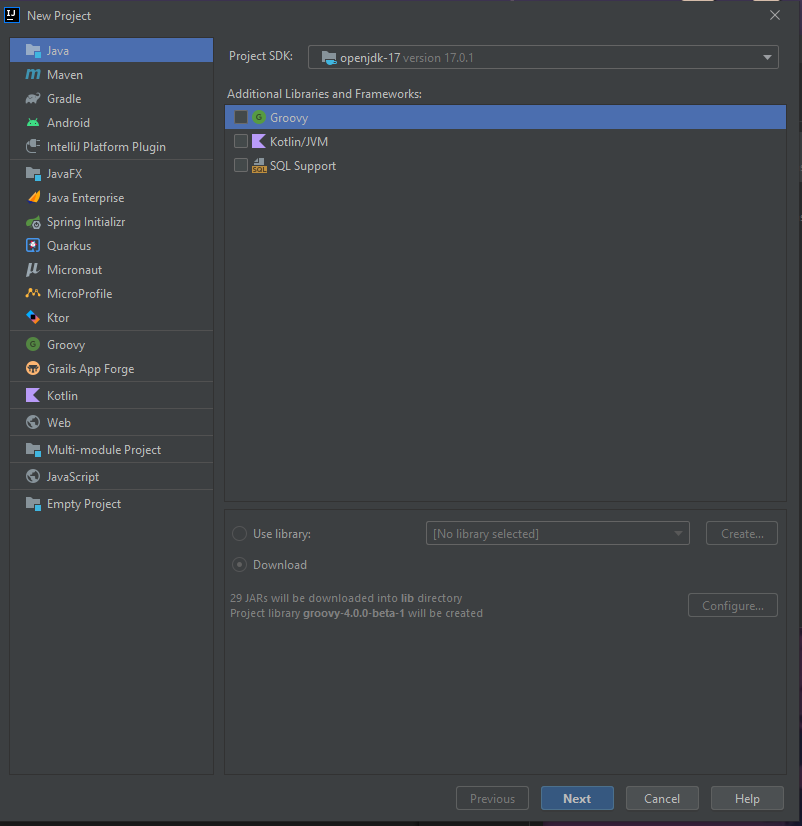
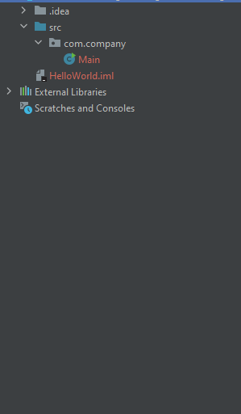
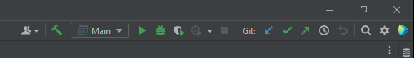
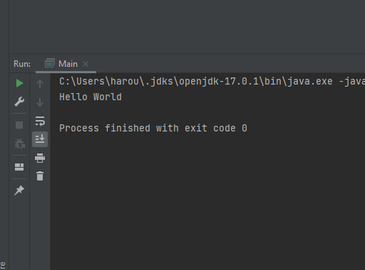

#Hello World!

Intellij Idea is an IDE (Integrated Development Enviorment) IDEs are what we use to write and compile our code.
Intellij Idea like most modern IDEs is rich with features for example error checking, code generation etc.

to get started please launch intellij Idea on your computer.
when you launch it you will be presented with this screen, after using Intellij you will see the Projects being added to the Recent Projects box



click on the New Project button in the Top right corner and the New Project screen will open



select Java in the left panel and click next *Do not add additional framework support*

next you will be greeted by a screen with a singular checkbox asking if you want to create the project using the Command line App template, click that checkbox, then click next

on the left side of the screen you should see the Project navigation panel.
to expand the folders click on the Small arrow on the left.
Expand the src folder and all it's subfolders until you see the Main.java class.




double click the Main.java file to open it in the editor

it should look something like this:

```
package com.company;

public class Main {

    public static void main(String[] args) {

    }
}
```

click in the method void main between the curly brackets and type `System.out.println("Hello World");`
then right click in the text editor and click run or alternatively click on the green run button in the top right corner of the IDE.



then you should see the console on the bottom of your screen, if everything is correct in your program you it should look like this:



if something is wrong in your program the console will output error messages, these error messages describe what went wrong in the program so read it carefully.
if you do not understand what the error message means, you can just copy/paste it into google and in most cases you will find results.


you've successfully created your first Java application!

